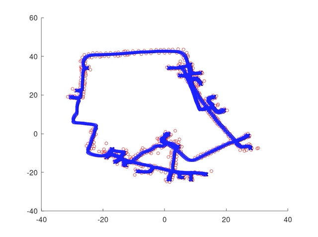

# SLAM_Course

## Odometry Motion Model:

## EFK_SLAM:

## UFK_SLAM:

## Particle Filter:

## Gridmapping:

## FastSlam:

## Odometry Calibration:

## Graph-based SLAM:
1. On dlr dataset:

2. On intel research lab dataset:

